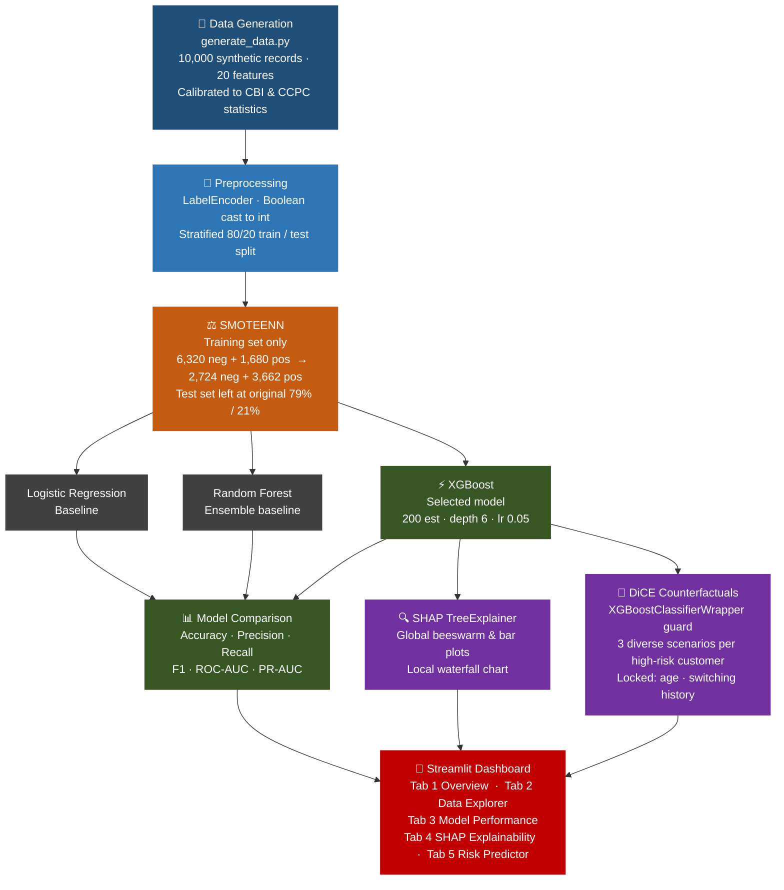

<div align="center">

# 🏦 Irish Banking Customer Churn Predictor

**An explainable machine learning system built around the largest account migration event in Irish banking history.**

[](https://python.org)
[](https://xgboost.readthedocs.io)
[](https://abinashprasana-irish-banking-churn-app-aidovf.streamlit.app/)
[](.)
[](.)

<br/>

*KBC Bank Ireland & Ulster Bank exits 2022–2023 · 1.2M accounts migrated · SMOTEENN · SHAP · DiCE · EU AI Act Article 86*

</div>

---

## 📖 What This Project Is

When KBC Bank Ireland and Ulster Bank (NatWest Group) exited the Irish retail banking market between 2022 and 2023, over 1.2 million customers were forced to close their accounts and move to one of the three remaining lenders — Allied Irish Banks (AIB), Bank of Ireland, and Permanent TSB — within a compressed two-year window. It was the most disruptive mass migration in the history of Irish retail banking.

This project models the churn risk that persists from that disruption. Approximately 60% of those switchers experienced serious friction during the move — direct debit failures, transfer delays, poor service — and behavioural research consistently shows that institutional trust takes 3 to 5 years to rebuild after a forced migration. Now in 2025–2026, those customers are in their third or fourth year with a new provider, and the Irish market is still in an elevated switching risk window that will not normalise before 2027.

The system predicts which customers are most likely to leave next, explains exactly why using SHAP Shapley values, and generates actionable retention suggestions using DiCE counterfactual explanations. Everything is surfaced through a five-tab Streamlit dashboard.

---

## 🎬 Live Demo

**[→ Open the live app on Streamlit Community Cloud](https://abinashprasana-irish-banking-churn-app-aidovf.streamlit.app/)**

Five-tab interactive dashboard — Overview, Data Explorer, Model Performance, SHAP Explainability, and Risk Predictor. No setup required; runs entirely in the browser.

---

## 🗃️ Dataset

<div align="center">

| Detail | Value |
|:---|:---|
| 📦 Type | Fully synthetic, statistically calibrated |
| 📋 Total records | 10,000 customer profiles |
| 🎯 Churn rate | ~21% (2,100 churners, 7,900 retained) |
| 🏗️ Features | 20 input variables |
| 📐 Train / test split | 80% training (8,000) / 20% test (2,000), stratified |
| 🏦 Migration flag | ~15% former KBC Bank Ireland or Ulster Bank customers |
| 😤 Switching difficulty | 60% of migrated customers experienced friction |
| 📊 Sources | Central Bank of Ireland, CCPC 2022 account migration survey |

</div>

All records are synthetic. Statistical parameters were modelled on real published figures from the Central Bank of Ireland and Competition and Consumer Protection Commission (CCPC). No real customer data was used at any point.

The dataset includes Irish-specific features not found in standard churn datasets: `was_kbc_ulster_customer`, `months_since_switching`, `experienced_switching_difficulty`, and `uses_digital_bank_secondary` (Revolut / N26 usage) — which together capture the structural switching risk that the 2022–2023 exits created.

---

## 🧠 Pipeline Architecture



---

## 📊 Model Performance

Three classifiers were trained and evaluated on the original imbalanced test set. XGBoost was selected as the deployed model.

<div align="center">

| Model | Accuracy | Precision | Recall | F1 Score | ROC-AUC | PR-AUC |
|:---|:---:|:---:|:---:|:---:|:---:|:---:|
| **XGBoost (Selected)** | **0.8990** | **0.7080** | **0.8833** | **0.7860** | **0.9593** | **0.8420** |
| Random Forest | 0.8790 | 0.6660 | 0.8500 | 0.7469 | 0.9438 | 0.7708 |
| Logistic Regression | 0.8385 | 0.5883 | 0.7690 | 0.6667 | 0.9011 | 0.7403 |

</div>

PR-AUC is the primary metric here because the test set is imbalanced. A model that flags every customer as retained would score 79% accuracy — PR-AUC removes that distortion by measuring precision and recall simultaneously across all decision thresholds. XGBoost's PR-AUC of **0.842** represents a **+0.102 improvement** over the Logistic Regression baseline.

<div align="center">

| Metric vs. LR Baseline | XGBoost Gain |
|:---|:---:|
| F1 Score | **+0.119** |
| ROC-AUC | **+0.058** |
| PR-AUC | **+0.102** |

</div>

---

## 🔍 Feature Importance (SHAP)

SHAP Shapley values were computed using `TreeExplainer` on the full 2,000-record test set. These are the top 5 drivers of churn probability globally across the portfolio.

<div align="center">

| Rank | Feature | Mean Absolute SHAP | What It Captures |
|:---:|:---|:---:|:---|
| 1 | `num_products` | **2.841** | Product depth is the single strongest retention anchor. One product means no switching friction. |
| 2 | `months_since_switching` | **1.028** | Recency of the 2022–2023 migration. The wound is still fresh for recent switchers. |
| 3 | `has_direct_debits` | **0.883** | Direct debits tie customers to their bank. Absence is a strong churn signal. |
| 4 | `tenure_months` | **0.838** | Longer relationships reduce switching intent. |
| 5 | `has_savings_goal` | **0.529** | Goal-based accounts increase emotional engagement with the bank. |

</div>

The two highest-ranked features are structural: product depth and recency of the forced migration. This confirms what the dataset was built to capture — the 2022–2023 exits are still the dominant driver of switching risk in the Irish market in 2025–2026.

---

## ⚡ Sample Counterfactual Explanations (DiCE)

DiCE generates diverse counterfactual scenarios — the minimum changes needed to move a high-risk customer below the churn threshold. These are displayed in the Risk Predictor tab for any customer predicted above 50% churn probability.

<details>
<summary>🔴 Sample: high-risk customer (87% churn probability)</summary>

```
Input profile:
  age=34 · tenure=8 months · num_products=1 · has_direct_debits=False
  was_kbc_ulster_customer=True · months_since_switching=9
  has_savings_goal=False · credit_score_band=Low

Scenario 1 — Increase product depth and set up direct debits:
  num_products:       1  →  3
  has_direct_debits:  0  →  1
  direct_debit_count: 0  →  4
  → Predicted outcome: Retained (12% risk)

Scenario 2 — Introduce savings goal and increase engagement:
  has_savings_goal:          0  →  1
  monthly_transaction_count: 11  →  34
  → Predicted outcome: Retained (31% risk)

Scenario 3 — Increase balance and transaction volume:
  monthly_balance_eur:       420  →  3,100
  monthly_transaction_count: 11   →  52
  → Predicted outcome: Retained (44% risk)
```

> These are model-generated suggestions only. A relationship manager should review and validate before any customer contact.
</details>

---

## 📁 Project Structure

```
irish-banking-churn/
├── 📄 app.py                         Streamlit five-tab dashboard
├── 📋 requirements.txt               Project dependencies
├── 📄 model_card.md                  Model card (metrics, limitations, regulatory context)
│
├── 📂 data/
│   ├── generate_data.py              Synthetic dataset generator (10,000 records)
│   └── irish_banking_churn.csv       Generated dataset [git-ignored]
│
├── 📂 models/
│   ├── train_model.py                Training pipeline — preprocessing, SMOTEENN,
│   │                                 model comparison, SHAP, DiCE verification
│   └── xgboost_churn_model.pkl       Serialized model bundle [git-ignored]
│
└── 📂 assets/
    ├── shap_summary_plot.png         Global SHAP beeswarm plot [git-ignored]
    └── shap_bar_plot.png             Global SHAP bar plot [git-ignored]
```

---

## ⚙️ How to Run

**1. Clone the repository**
```bash
git clone https://github.com/abinashprasana/irish-banking-churn.git
cd irish-banking-churn
```

**2. Create a virtual environment and install dependencies**
```bash
python -m venv venv

# Windows
.\venv\Scripts\activate

# macOS / Linux
source venv/bin/activate

pip install -r requirements.txt
```

**3. Generate the synthetic dataset**
```bash
python data/generate_data.py
```
Outputs `data/irish_banking_churn.csv` with 10,000 records and a ~21% churn rate.

**4. Train the model**
```bash
python models/train_model.py
```
Trains all three classifiers, prints the full comparison table, saves `models/xgboost_churn_model.pkl`, and exports both SHAP plots to `assets/`.

**5. Launch the Streamlit dashboard**
```bash
streamlit run app.py
```
Opens at `http://localhost:8501`. The Risk Predictor tab requires the trained model to be present.

---

## ⚠️ Limitations

This is a portfolio project demonstrating a complete ML pipeline with explainability and regulatory compliance scaffolding. A few honest caveats.

The dataset is synthetic. Even with carefully calibrated parameters, synthetic data cannot fully replicate real customer behaviour — particularly the long-tail patterns that drive edge-case predictions. A model trained here would need retraining on real bank data before any deployment consideration.

The model does not incorporate macroeconomic variables. Interest rate movements, housing market conditions, and inflationary pressures all drive financial migration decisions in ways this model cannot currently detect.

The Irish-specific switching features (`was_kbc_ulster_customer`, `months_since_switching`) are time-sensitive. As the post-2022 migration period normalises toward 2027, their signal strength will decay and model weights will need recalibration to avoid over-weighting stale patterns.

<div align="center">

| 🔧 Extension | 📈 What It Would Add |
|:---|:---|
| Real bank transaction data | Actual behavioural signal, not simulated |
| Macroeconomic features | Interest rate and housing market sensitivity |
| Quarterly retraining pipeline | Adapts as the market normalises post-migration |
| Larger feature set (50+ variables) | Richer engagement and product-use signals |
| Online learning component | Detects drift without full retrains |

</div>

---

## 🏛️ Regulatory Context

Under **Article 86 of the EU AI Act**, consumers have a right to explanation when subjected to significant automated decisions affecting their access to financial services. Marking a customer as high-risk for churn can influence product recommendations, retention treatments, or credit availability decisions. This project satisfies that requirement with SHAP local waterfall charts (mathematical explanation of the individual prediction) and DiCE counterfactuals (actionable alternatives showing what would change the outcome).

Under the **EBA Guidelines on Internal Governance**, automated AI decisions in financial services must retain human-in-the-loop oversight. The Risk Predictor tab is explicitly designed as a decision-support tool for relationship managers, not an autonomous action-taker. All counterfactual suggestions carry a note that they require advisor review before any customer contact.

For full model details, validation configurations, and ethical considerations, see [model_card.md](model_card.md).

---

## 🧰 Technical Stack

<div align="center">

| Library | Purpose |
|:---|:---|
| **pandas** | Structured data manipulation and CSV management |
| **numpy** | Vectorized operations and statistical calculations |
| **scikit-learn** | Train/test splits, LabelEncoding, baseline classifiers |
| **xgboost** | Gradient boosted trees classifier |
| **imbalanced-learn** | SMOTEENN for class imbalance handling |
| **shap** | Shapley values for global and local explainability |
| **dice-ml** | Diverse counterfactual explanations for retention guidance |
| **streamlit** | Five-tab interactive dashboard |
| **plotly** | Interactive charts in the Data Explorer and Performance tabs |
| **matplotlib / seaborn** | SHAP plot rendering |
| **faker** | Synthetic customer demographic generation |
| **joblib** | Model serialization |

</div>

---

## 👤 Author

**Abinash Prasana Selvanathan**

*If you found this useful, feel free to ⭐ star the repo.*
