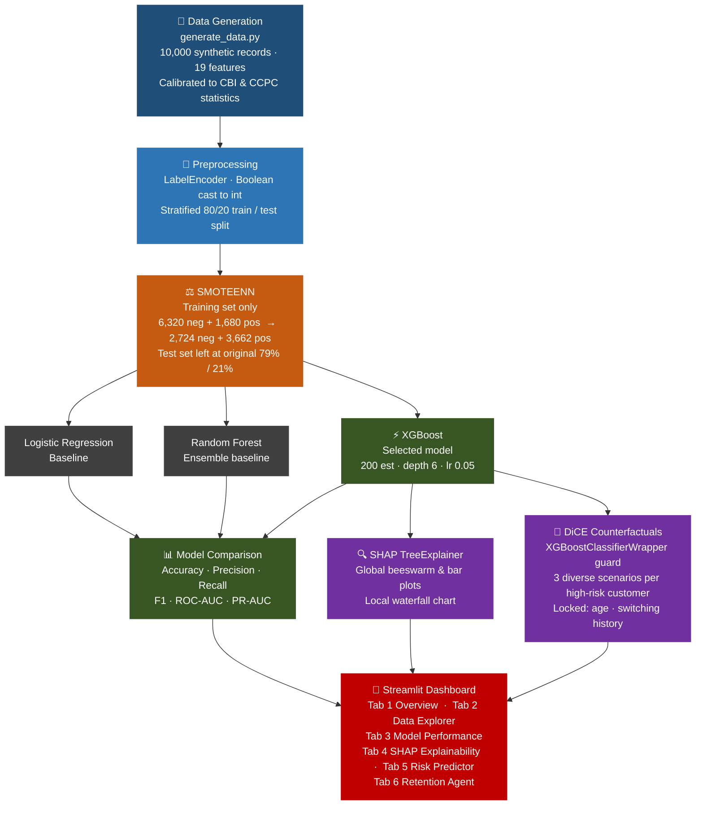
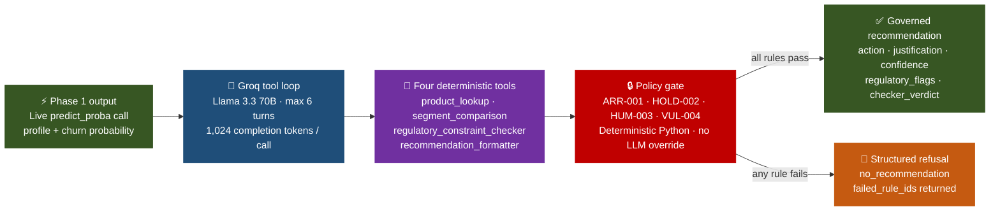

<div align="center">

# 🏦 Irish Banking Customer Churn & Retention Agent

**An explainable machine learning system and a governed AI agent built around the largest account migration event in Irish banking history.**

[](https://python.org)
[](https://xgboost.readthedocs.io)
[](https://console.groq.com/docs/model/llama-3.3-70b-versatile)
[](https://abinashprasana-irish-banking-churn-app-aidovf.streamlit.app/)
[](.)
[](.)

<br/>

*KBC Bank Ireland & Ulster Bank exits 2022–2023 · 1.2M accounts migrated · SMOTEENN · SHAP · DiCE · Agentic Retention Recommendations · Groq Llama 3.3 · EU AI Act Article 86*

</div>

---

## 📖 What This Project Is

Between 2022 and 2023, KBC Bank Ireland and Ulster Bank (NatWest Group) both pulled out of the Irish retail banking market. That forced over 1.2 million customers to close their accounts and find a new bank, all within a short window. It caused real chaos: around 60% of people who switched reported serious problems, things like direct debits failing, money not transferring correctly, and poor customer support throughout.

I built this project because those customers haven't just settled in and moved on. Research shows institutional trust takes 3 to 5 years to rebuild after a forced switch, and we're only in year 3 or 4 now. That means Irish banks are still sitting on an unusually high churn risk that won't calm down before 2027. I wanted to build something that actually reflects that. Not a generic churn model, but one calibrated to what's happening in this specific market right now.

The result is an XGBoost classifier that predicts which customers are most likely to leave, SHAP values that explain why, and DiCE counterfactuals that suggest what a relationship manager could actually do about it. The whole thing runs in a six-tab Streamlit dashboard. But prediction and explanation alone still leave a gap: a relationship manager looking at a 99% churn probability and a SHAP waterfall still has to figure out what to actually offer that customer, whether it's allowed under policy, and whether a human needs to sign off first. The sixth tab closes that gap with an AI retention agent that takes a flagged customer, investigates the options using four deterministic tools, and returns a policy-checked recommendation, or a structured refusal if the rules say no.

---

## 🎬 Live Demo

[](https://abinashprasana-irish-banking-churn-app-aidovf.streamlit.app/)

No setup needed, runs directly in the browser.

---

## 🗃️ Dataset

<div align="center">

| Detail | Value |
|:---|:---|
| 📦 Type | Fully synthetic, statistically calibrated |
| 📋 Total records | 10,000 customer profiles |
| 🎯 Churn rate | ~21% (2,100 churners, 7,900 retained) |
| 🏗️ Features | 19 input variables |
| 📐 Train / test split | 80% training (8,000) / 20% test (2,000), stratified |
| 🏦 Migration flag | ~15% former KBC Bank Ireland or Ulster Bank customers |
| 😤 Switching difficulty | 60% of migrated customers experienced friction |
| 📊 Sources | Central Bank of Ireland, CCPC 2022 account migration survey |

</div>

All records are synthetic. No real customer data was used. I built the statistical parameters around actual published figures from the Central Bank of Ireland and the CCPC's 2022 account migration survey, so the distributions reflect what the real market looks like rather than being made up.

What makes this dataset different from a standard churn dataset is the Irish-specific columns: `was_kbc_ulster_customer`, `months_since_switching`, `experienced_switching_difficulty`, and `uses_digital_bank_secondary` (Revolut / N26 usage). Those four features are what lets the model capture the migration-driven risk that standard banking churn models would miss entirely.

---

## 🧠 Pipeline Architecture


```mermaid
flowchart TD
    A["📁 Data Generation\ngenerate_data.py\n10,000 synthetic records · 19 features\nCalibrated to CBI & CCPC statistics"]
    B["🔧 Preprocessing\nLabelEncoder · Boolean cast to int\nStratified 80/20 train / test split"]
    C["⚖️ SMOTEENN\nTraining set only\n6,320 neg + 1,680 pos  →  2,724 neg + 3,662 pos\nTest set left at original 79% / 21%"]
    D1["Logistic Regression\nBaseline"]
    D2["Random Forest\nEnsemble baseline"]
    D3["⚡ XGBoost\nSelected model\n200 est · depth 6 · lr 0.05"]
    E["📊 Model Comparison\nAccuracy · Precision · Recall\nF1 · ROC-AUC · PR-AUC"]
    F1["🔍 SHAP TreeExplainer\nGlobal beeswarm & bar plots\nLocal waterfall chart"]
    F2["🎲 DiCE Counterfactuals\nXGBoostClassifierWrapper guard\n3 diverse scenarios per high-risk customer\nLocked: age · switching history"]
    G["🏦 Streamlit Dashboard\nTab 1 Overview  ·  Tab 2 Data Explorer\nTab 3 Model Performance\nTab 4 SHAP Explainability  ·  Tab 5 Risk Predictor\nTab 6 Retention Agent"]

    A --> B --> C
    C --> D1 & D2 & D3
    D1 & D2 & D3 --> E
    D3 --> F1 & F2
    E & F1 & F2 --> G

    style A fill:#1f4e79,color:#ffffff,stroke:#1f4e79
    style B fill:#2e75b6,color:#ffffff,stroke:#2e75b6
    style C fill:#c55a11,color:#ffffff,stroke:#c55a11
    style D1 fill:#404040,color:#ffffff,stroke:#404040
    style D2 fill:#404040,color:#ffffff,stroke:#404040
    style D3 fill:#375623,color:#ffffff,stroke:#375623
    style E fill:#375623,color:#ffffff,stroke:#375623
    style F1 fill:#7030a0,color:#ffffff,stroke:#7030a0
    style F2 fill:#7030a0,color:#ffffff,stroke:#7030a0
    style G fill:#c00000,color:#ffffff,stroke:#c00000
```

---

## 📊 Model Performance

I trained three classifiers and compared them on the original imbalanced test set. XGBoost came out clearly ahead on every metric.

<div align="center">

| Model | Accuracy | Precision | Recall | F1 Score | ROC-AUC | PR-AUC |
|:---|:---:|:---:|:---:|:---:|:---:|:---:|
| **XGBoost (Selected)** | **0.8990** | **0.7080** | **0.8833** | **0.7860** | **0.9593** | **0.8420** |
| Random Forest | 0.8790 | 0.6660 | 0.8500 | 0.7469 | 0.9438 | 0.7708 |
| Logistic Regression | 0.8385 | 0.5883 | 0.7690 | 0.6667 | 0.9011 | 0.7403 |

</div>

I used PR-AUC as the primary metric rather than accuracy because the test set is imbalanced. A model that labels every customer as "retained" would still hit 79% accuracy, which is useless. PR-AUC measures how well the model performs across all possible decision thresholds without that distortion. XGBoost's **0.842** PR-AUC is a **+0.102 gain** over Logistic Regression, which is a meaningful jump on an imbalanced problem.

<div align="center">

| Metric vs. LR Baseline | XGBoost Gain |
|:---|:---:|
| F1 Score | **+0.119** |
| ROC-AUC | **+0.058** |
| PR-AUC | **+0.102** |

</div>

---

## 🔍 Feature Importance (SHAP)

SHAP Shapley values were computed using `TreeExplainer` on the full 2,000-record test set. The top 5 features driving churn predictions across the portfolio are:

<div align="center">

| Rank | Feature | Mean Absolute SHAP | What It Means |
|:---:|:---|:---:|:---|
| 1 | `num_products` | **2.841** | The single strongest retention anchor. Customers with only one product have nothing tying them to the bank. |
| 2 | `months_since_switching` | **1.028** | How recently the customer was forced to switch. More recent = higher risk. |
| 3 | `has_direct_debits` | **0.883** | Direct debits create real friction to leave. No direct debits is a clear warning sign. |
| 4 | `tenure_months` | **0.838** | Longer relationships reduce switching intent, regardless of how they started. |
| 5 | `has_savings_goal` | **0.529** | Customers with a savings goal are more engaged and less likely to leave. |

</div>

The fact that `num_products` and `months_since_switching` are the top two features is exactly what I expected. Product depth is the main thing keeping customers in place, and the recency of the forced migration is still the dominant risk factor, which is why this model makes sense specifically for the current Irish market moment.

---

## ⚡ Sample Counterfactual Explanations (DiCE)

For any customer the model flags above 50% churn probability, the Risk Predictor tab generates three counterfactual scenarios: the smallest set of changes that would bring them below the churn threshold. These are meant to give relationship managers something concrete to work with, not just a risk score.

<details>
<summary>🔴 Sample output: high-risk customer at 87% churn probability</summary>

```
Input profile:
  age=34 · tenure=8 months · num_products=1 · has_direct_debits=False
  was_kbc_ulster_customer=True · months_since_switching=9
  has_savings_goal=False · credit_score_band=Low

Scenario 1: Add products and set up direct debits:
  num_products:       1  →  3
  has_direct_debits:  0  →  1
  direct_debit_count: 0  →  4
  → Predicted outcome: Retained (12% risk)

Scenario 2: Open a savings goal and increase transaction activity:
  has_savings_goal:          0  →  1
  monthly_transaction_count: 11  →  34
  → Predicted outcome: Retained (31% risk)

Scenario 3: Increase balance and transaction volume:
  monthly_balance_eur:       420  →  3,100
  monthly_transaction_count: 11   →  52
  → Predicted outcome: Retained (44% risk)
```

> These are model-generated suggestions. A relationship manager should review them before any customer contact.
</details>

---

## 🤖 Phase 2: AI Retention Agent

SHAP and DiCE answer two important questions: who is likely to leave, and why. But a relationship manager looking at a 99% churn probability and a waterfall chart still has to decide what to actually do. What offer is appropriate? Is it allowed for this specific customer? Does it need a human sign-off before anything goes out? Those questions are not about prediction. They are about action within rules.

That's what the retention agent handles. It takes the Phase 1 output for a flagged customer, uses four deterministic tools to look up what's available and what the customer's cohort looks like, proposes a retention action, and then runs it through a deterministic policy gate before it can become a recommendation. If the gate blocks the action, the output is a structured refusal, not an exception or a warning. The relationship manager sees exactly which rule failed and why.

### Agent Architecture


```mermaid
flowchart LR
    A["⚡ Phase 1 output\nLive predict_proba call\nprofile + churn probability"]
    B["🤖 Groq tool loop\nLlama 3.3 70B · max 6 turns\n1,024 completion tokens / call"]
    C["🔧 Four deterministic tools\nproduct_lookup · segment_comparison\nregulatory_constraint_checker\nrecommendation_formatter"]
    D["🔒 Policy gate\nARR-001 · HOLD-002 · HUM-003 · VUL-004\nDeterministic Python · no LLM override"]
    E["✅ Governed recommendation\naction · justification · confidence\nregulatory_flags · checker_verdict"]
    F["🚫 Structured refusal\nno_recommendation\nfailed_rule_ids returned"]

    A --> B --> C --> D
    D -->|all rules pass| E
    D -->|any rule fails| F

    style A fill:#375623,color:#ffffff,stroke:#375623
    style B fill:#1f4e79,color:#ffffff,stroke:#1f4e79
    style C fill:#7030a0,color:#ffffff,stroke:#7030a0
    style D fill:#c00000,color:#ffffff,stroke:#c00000
    style E fill:#375623,color:#ffffff,stroke:#375623
    style F fill:#c55a11,color:#ffffff,stroke:#c55a11
```

The churn probability in the agent prompt is not taken from a stored value. `run_retention_agent` calls `model.predict_proba` again at entry and overwrites whatever was passed in. The LLM sees the live model output.

### The Four Tools

<div align="center">

| Tool | What it does |
|:---|:---|
| 🗂️ `product_lookup` | Reads the local synthetic retention-offer catalogue; product policy metadata is authoritative and cannot be overridden by the model. |
| 📊 `segment_comparison` | Calls the trained Phase 1 model for the target customer's current churn risk, then computes an exact read-only cohort summary from the local dataset. |
| 🛡️ `regulatory_constraint_checker` | Runs all four deterministic policy rules against the exact customer and proposed action; issues an immutable decision fingerprinted to that specific pair. |
| 📋 `recommendation_formatter` | Validates the fixed Pydantic output schema and enforces the matching runtime-issued policy decision; the formatter cannot approve something the gate blocked. |

</div>

The policy gate is deterministic Python code. It evaluates all four rules on every run without short-circuiting, and the LLM has no mechanism to override its verdict. An action the gate blocks can only produce a structured `no_recommendation` refusal; it cannot be formatted as an approved recommendation.

The LLM backend is Groq (`llama-3.3-70b-versatile`, free tier). This is a deliberate cost-safe choice: the full tool-calling agent is available to every visitor on the live demo without an API bill, which would not have been possible with a paid-only provider. The governance properties (the bounded loop, the four tools, the deterministic gate) are identical regardless of which model is behind the API call. The tool-calling loop follows Groq's [local tool-calling guide](https://console.groq.com/docs/tool-use), and the in-process quota counters are sized against the published [rate-limit reference](https://console.groq.com/docs/rate-limits) for the free tier (30 RPM, 1,000 requests/day).

---

## 🧪 Agent Evaluation

<div align="center">

| Check | Result |
|:---|:---:|
| Tests passing (0 skipped) | **20 / 20** |
| Eval scenarios passing (dry-run) | **4 / 4** |
| Blocked outcomes in eval | **2 / 4** (minimum required: 2) |
| Groq API requests in dry-run | **0** |

</div>

The test suite covers the full tool-calling trajectory, individual `role: "tool"` results with matching call IDs, the deterministic policy rules, rate-limit counters (30 RPM, 950 requests/day, 5 session runs), the Groq SDK wire contract via fake transport, schema validation, and the two Phase 1 integration tests that prove different customer profiles produce different churn probabilities. Every test runs with sockets blocked and `GROQ_API_KEY` removed, so an accidental network call fails the test immediately rather than silently passing.

The dry-run eval does something worth explaining: for each of the four recorded demo scenarios, it re-runs `model.predict_proba` against the trained XGBoost artifact and checks that the stored churn probability matches the live model output within a tolerance of 1e-12. That check proves the numbers in the demo traces are real model outputs, not fabricated values. The traces also carry a `phase1_runtime_capture: true` marker, the model artifact name, and the prediction method string (`model.predict_proba(feature_vector)[0, 1]`) to make the provenance explicit.

---

## 🗂️ Sample Agent Traces

<details>
<summary>✅ Approved outcome: fee waiver with mandatory human review (IRLBANK_01136, 99.76% churn risk)</summary>

```
Customer: IRLBANK_01136
Phase 1 churn probability: 99.76%  (live predict_proba output)
Top churn drivers: months_since_switching=3, num_products=1, has_direct_debits=False

Agent reasoning:
  Step 1  model_thought   "This synthetic customer has a 99.76% churn probability.
                           I will inspect fee-relief options and compare the matching
                           local synthetic segment before proposing an action."

  Step 2  tool_call       product_lookup { "category": "fee_relief" }
  Step 3  tool_result     → fee_waiver_6m: Six-month maintenance fee waiver
                            is_credit: false · is_upsell: false

  Step 4  tool_call       segment_comparison {}
  Step 5  tool_result     → cohort: former_kbc_ulster · age 30–44 · Current Account · 1 product
                            cohort_size: 182 · churn_rate: 69.78%
                            Phase 1 live prediction: 99.76% (matches stored value within 1e-12)

  Step 6  model_thought   "The matching synthetic cohort has a 69.78% churn rate, and
                           the catalogue includes a non-credit, non-upsell six-month fee
                           waiver. Because this customer's churn probability exceeds 75%,
                           I will include human review and run the deterministic policy gate."

  Step 7  tool_call       regulatory_constraint_checker {
                            "action_id": "fee_waiver_6m",
                            "requires_human_review": true
                          }
  Step 8  gate_check      ARR-001: PASS · HOLD-002: PASS · HUM-003: PASS · VUL-004: PASS
                          checker_verdict: approved

  Step 9  model_thought   "All four deterministic rules approved fee_waiver_6m for this
                           exact customer and action. I can now send the governed action
                           to the formatter with the HUM-003 human-review flag."

  Step 10 tool_call       recommendation_formatter {
                            "action": "fee_waiver_6m",
                            "justification": "Six months of current-account fee relief
                              directly addresses retention friction without adding credit
                              or another product; a relationship manager must review
                              eligibility and account terms before contact.",
                            "confidence": 0.94,
                            "checker_verdict": "approved"
                          }

Final output:
  {
    "action": "fee_waiver_6m",
    "justification": "Six months of current-account fee relief directly addresses
                      retention friction without adding credit or another product;
                      a relationship manager must review eligibility and account
                      terms before contact.",
    "confidence": 0.94,
    "regulatory_flags": ["HUM-003:human_review_required"],
    "checker_verdict": "approved"
  }
```

> All customer records, governance flags, offers, and recommendations are synthetic demonstration data.
</details>

<details>
<summary>🚫 Blocked outcome: ARR-001 stops a credit action for a customer in arrears (IRLBANK_01255, 99.97% churn risk)</summary>

```
Customer: IRLBANK_01255
Phase 1 churn probability: 99.97%  (live predict_proba output)
Governance overlay: in_arrears: true (synthetic scenario metadata, not a Phase 1 feature)
Top churn drivers: monthly_transaction_count=12, num_products=1, has_direct_debits=False

Agent reasoning:
  Step 1  model_thought   "Inspect the local synthetic offer catalogue and the comparable
                           Phase 1 segment before proposing an action."

  Step 2  tool_call       product_lookup { "category": "mortgage" }
  Step 3  tool_result     → mortgage_fixed_rate_review: Fixed-rate mortgage suitability review
                            is_credit: true · is_upsell: true

  Step 4  tool_call       segment_comparison {}
  Step 5  tool_result     → cohort: other · age 30–44 · Savings Account · 1 product
                            cohort_size: 329 · churn_rate: 69.60%
                            Phase 1 live prediction: 99.97% (matches stored value within 1e-12)

  Step 6  model_thought   "The mortgage review is a credit-related upsell, so it must
                           pass the deterministic gate for this exact synthetic customer
                           and action."

  Step 7  tool_call       regulatory_constraint_checker {
                            "action_id": "mortgage_fixed_rate_review",
                            "requires_human_review": true
                          }
  Step 8  gate_check      ARR-001: FAIL. "Blocked: the customer is in arrears and the
                                           proposed action is credit-related."
                          HOLD-002: PASS · HUM-003: PASS · VUL-004: PASS
                          checker_verdict: blocked
                          failed_rule_ids: ["ARR-001"]

  Step 9  model_thought   "ARR-001 blocks the proposed credit action. Emit a structured
                           refusal instead of an unchecked recommendation."

  Step 10 tool_call       recommendation_formatter {
                            "action": "no_recommendation",
                            "justification": "The proposed mortgage action is credit-related
                              and is blocked because this synthetic customer is flagged
                              as in arrears.",
                            "confidence": 1.0,
                            "checker_verdict": "blocked"
                          }

Final output:
  {
    "action": "no_recommendation",
    "justification": "The proposed mortgage action is credit-related and is blocked
                      because this synthetic customer is flagged as in arrears.",
    "confidence": 1.0,
    "regulatory_flags": ["ARR-001"],
    "checker_verdict": "blocked"
  }
```

> The blocked outcome is a governed result, not an error. The relationship manager sees which rule failed and why, not a raw exception.
</details>

---

## 📁 Project Structure

```
irish-banking-churn/
├── 📄 app.py                         Streamlit six-tab dashboard
├── 📋 requirements.txt               Project dependencies
├── 📄 model_card.md                  Model card (metrics, limitations, regulatory context)
│
├── 📂 agent/
│   ├── loop.py                       Groq Chat Completions tool loop · bounded while · mock default
│   ├── tools.py                      Four tools · Phase 1 runtime · strict Pydantic schema
│   ├── policy_rules.py               Deterministic rules and immutable fingerprinted decisions
│   ├── rate_limits.py                Process-local 30 RPM / 950-request daily / 5-run session caps
│   └── trace.py                      Five-event structured trace recorder
│
├── 📂 data/
│   ├── generate_data.py              Synthetic dataset generator (10,000 records)
│   └── irish_banking_churn.csv       Generated dataset [git-ignored]
│
├── 📂 demo_traces/                   Four complete zero-request offline runs; 2 of 4 are refusals
│   ├── 01_allowed_fee_waiver.json    Approved: fee relief · HUM-003 human review required
│   ├── 02_allowed_service_review.json Approved: dedicated service review · high-risk customer
│   ├── 03_blocked_arrears_credit.json Blocked: ARR-001 stops credit action
│   └── 04_blocked_vulnerable_upsell.json Blocked: VUL-004 stops upsell for vulnerable customer
│
├── 📂 models/
│   ├── train_model.py                Training pipeline: preprocessing, SMOTEENN,
│   │                                 model comparison, SHAP, DiCE verification
│   └── xgboost_churn_model.pkl       Serialized model bundle (tracked in git)
│
├── 📂 scripts/
│   ├── eval_agent.py                 Recorded dry-run eval (zero requests) and optional live Groq eval
│   └── record_demo_runs.py           Owner-only script to refresh demo traces via live Groq calls
│
├── 📂 tests/                         20 deterministic tests · sockets blocked · no API key required
│   ├── conftest.py                   Removes GROQ_API_KEY and blocks socket connections for every test
│   ├── test_agent.py                 Loop trajectory · rate limits · Groq SDK wire contract
│   ├── test_phase1_integration.py    Live predict_proba · cache · schema mismatch failures
│   ├── test_policy.py                All four rules · immutable decisions · formatter bypass resistance
│   └── test_foundation.py           Document assertions: README content and integration boundary
│
└── 📂 assets/
    ├── shap_summary_plot.png         Global SHAP beeswarm plot [git-ignored]
    └── shap_bar_plot.png             Global SHAP bar plot [git-ignored]
```

---

## ⚙️ How to Run

**1. Clone the repository**
```bash
git clone https://github.com/abinashprasana/irish-banking-churn.git
cd irish-banking-churn
```

**2. Create a virtual environment and install dependencies**
```bash
python -m venv venv

# Windows
.\venv\Scripts\activate

# macOS / Linux
source venv/bin/activate

pip install -r requirements.txt
```

**3. Generate the synthetic dataset**
```bash
python data/generate_data.py
```
This creates `data/irish_banking_churn.csv` with 10,000 records at a ~21% churn rate.

**4. Train the model**
```bash
python models/train_model.py
```
Trains all three classifiers, prints the comparison table, saves the XGBoost model to `models/xgboost_churn_model.pkl`, and exports both SHAP plots to `assets/`.

**5. Run the test suite**
```bash
python -m pytest -q
```
20 deterministic tests. Sockets are blocked and `GROQ_API_KEY` is removed for every test, so an accidental network call fails immediately. Expected output: `20 passed`.

**6. Configure the Groq free-tier backend (optional, for live agent runs)**

The Retention Agent tab works without a key, replaying the four recorded zero-request demo traces. To enable live agent calls, set `GROQ_API_KEY` to a [Groq free-tier key](https://console.groq.com/keys):

```bash
# Windows
$env:GROQ_API_KEY = "your-free-tier-key"

# macOS / Linux
export GROQ_API_KEY="your-free-tier-key"
```

For Streamlit Community Cloud, add `GROQ_API_KEY = "..."` under **App settings → Secrets**. The app reads `st.secrets` first and falls back to the process environment. The key is never hardcoded, logged, or visible to visitors.

**7. Launch the dashboard**
```bash
streamlit run app.py
```
Opens at `http://localhost:8501`. Tabs 1–5 cover the Phase 1 model. Tab 6 is the Retention Agent: select a scenario, click **Run live governed recommendation** (if a key is configured), and step through the full tool-calling trace.

**8. Validate the recorded traces and run the dry-run eval**
```bash
python scripts/eval_agent.py --dry-run
```
Replays all four recorded scenarios, verifies tool-call/result ID matching, validates the Pydantic recommendation schema, re-runs `model.predict_proba` to confirm the stored probabilities are real, and checks that at least two of four scenarios result in a blocked outcome. Makes zero Groq API requests. Expected output: `4/4 PASS`.

---

## ⚠️ Limitations

This is a student portfolio project, so I want to be upfront about what it is and isn't.

The data is synthetic. I calibrated it carefully against real published statistics, but synthetic data still can't replicate the full complexity of real customer behaviour. Before this model could be used in production, it would need to be retrained on actual bank data.

The model also doesn't know anything about the broader economy. Interest rates, the housing market, inflation: all of these push people to switch banks, and none of that is in here. That's a gap.

The two Irish-specific features (`was_kbc_ulster_customer`, `months_since_switching`) will become less useful over time as the post-2022 migration period settles. Once the market normalises post-2027, those signals will decay and the model weights will need recalibrating.

The Retention Agent is deliberately narrow. The catalogue, governance overlays, four policy rules, and recorded traces are all synthetic. The `in_arrears` and `vulnerable_customer` flags are explicit scenario metadata rather than Phase 1 model features. The agent never infers them from the churn score. The policy gate demonstrates a fail-closed engineering pattern informed by EBA expectations, but four rules applied to a synthetic catalogue are not a complete conduct-risk framework, eligibility engine, or production banking control. The live Groq path has been validated by automated fake-transport tests that confirm the tool-calling contract, schema format, and matching call IDs are all correct, but a smoke test against the real Groq API endpoint should be run before any live interview demo.

<div align="center">

| 🔧 If I were to extend this | 📈 What it would add |
|:---|:---|
| Real bank transaction data | Actual behavioural signal instead of simulated |
| Macroeconomic features | Sensitivity to interest rates and housing market |
| Quarterly retraining | Keeps up as the market normalises post-migration |
| Larger feature set | More granular engagement and product-use signals |
| Online learning | Catches drift without needing full retrains |
| Live Groq smoke test in CI | Catches real API drift or breaking schema changes before deploy |
| Expanded policy rule set | Closer coverage of actual conduct-risk and eligibility requirements |

</div>

---

## 🏛️ Regulatory Context

Under **Article 86 of the EU AI Act**, customers have a right to an explanation when an automated system makes a significant decision about their financial situation. Flagging someone as high-risk for churn can lead to changes in what products they're offered or how they're treated, so that needs to be explainable. The SHAP waterfall chart in the Risk Predictor tab gives a mathematical breakdown of exactly what pushed any individual prediction in either direction, and the DiCE counterfactuals show what would have to change to get a different outcome.

The **EBA Guidelines on Internal Governance** also require human oversight for automated decisions in financial services. The dashboard is built as a decision-support tool for relationship managers, not a system that takes automatic action. Every counterfactual output carries a note making that clear.

The retention agent extends this to Phase 2. Every recommendation the agent produces has passed through a deterministic Python policy gate before it reaches the relationship manager. The LLM cannot approve an action that the gate blocks, and the gate runs every rule without short-circuiting on every single run. The `HUM-003` rule additionally enforces that high-risk customers (above the 75% threshold) cannot receive a recommendation at all unless human review is explicitly included in the proposed action. The relationship manager is never presented with an output that bypassed that check. This is the same human-oversight principle already applied in Phase 1, extended into a structured, auditable form for Phase 2.

Full details on the model, its validation, and ethical considerations are in [model_card.md](model_card.md).

---

## 👤 Author

**Abinash Prasana Selvanathan**

*If you found this useful, feel free to ⭐ star the repo.*
