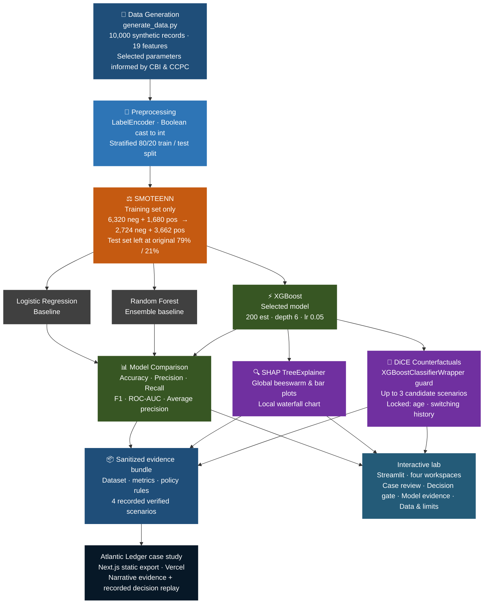
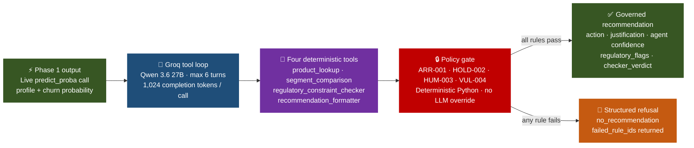

<div align="center">

# Atlantic Ledger

**Irish banking churn and governed retention intelligence.**

[](https://python.org)
[](https://xgboost.readthedocs.io)
[](https://console.groq.com/docs/tool-use)
[](https://payments-analytics-kappa.vercel.app/)
[](https://abinashprasana-irish-banking-churn-app-aidovf.streamlit.app/)
[](.)
[](.)

<br/>

*Know who may leave. Decide with care. · Synthetic Irish banking data · SMOTEENN · XGBoost · SHAP · DiCE · Deterministic policy controls*

</div>

---

## 📖 What This Project Is

KBC Bank Ireland and Ulster Bank announced their exit from the Irish market in 2021. The [Central Bank of Ireland](https://www.centralbank.ie/statistics/data-and-analysis/credit-and-banking-statistics/account-migration-statistics) recorded 1,167,219 current and deposit account closures at the two banks between the start of 2022 and the end of June 2023. Separate [CCPC research](https://www.ccpc.ie/about-us/advocacy-and-research/research/publication-details/ccpc-switching-research-%28phase-2%29) found that 60% of respondents who had an open KBC or Ulster current account, or had closed one within the previous six months, experienced switching challenges.

That gives the project a real Irish setting, but it doesn't prove those same customers still carry unusually high churn risk today. The dataset here is synthetic, built with migration-related fields to explore that question, not to measure how any bank's actual customers behave right now.

The result is **Atlantic Ledger**, built as two surfaces. A statically generated Next.js case-study shell walks through the banking context, model evidence, recorded decision replays, the governance boundary, and the limitations. A linked Streamlit lab sits alongside it with four task-oriented workspaces: **Case review**, **Decision gate**, **Model evidence**, and **Data & limits**.

Underneath both, an XGBoost classifier estimates churn probability, SHAP explains what the fitted model is doing, and DiCE searches for candidate counterfactual inputs. None of that decides what happens next on its own. The governed agent takes it from there: four deterministic tools and a fail-closed policy gate return either a policy-checked recommendation or a structured refusal. The public case study only reads a generated, sanitized evidence bundle. It doesn't expose a public inference API or an LLM secret.

---

## 🖥️ Product Surfaces

- **[Open the case study](https://payments-analytics-kappa.vercel.app/)** (source in `web/`) · the evidence narrative, model comparison, governed decision replay, and limitations, statically exported to Vercel.
- **[Open the interactive lab](https://abinashprasana-irish-banking-churn-app-aidovf.streamlit.app/)** · run synthetic case reviews, inspect SHAP/DiCE output, explore model evidence, and use recorded or configured live decision-gate mode.

The Streamlit lab opens directly in the browser. The case-study replay is recorded and makes zero provider requests.

---

## 🗃️ Dataset

<div align="center">

| Detail | Value |
|:---|:---|
| 📦 Type | Fully synthetic, generated locally |
| 📋 Total records | 10,000 customer profiles |
| 🎯 Churn rate | ~21% (2,100 churners, 7,900 retained) |
| 🏗️ Features | 19 input variables |
| 📐 Train / test split | 80% training (8,000) / 20% test (2,000), stratified |
| 🏦 Migration flag | ~15% former KBC Bank Ireland or Ulster Bank customers |
| 😤 Switching difficulty | 60% of surveyed respondents experienced challenges |
| 📊 Sources | Central Bank of Ireland, CCPC 2022 account migration survey |

</div>

All records are synthetic. No real customer data was used anywhere in building it. The generator borrows the CCPC's 60 percent figure and applies it as the switching-difficulty probability for migration-flagged synthetic records, which is a modelling assumption on my part, not a subgroup estimate the CCPC itself reported. Central Bank data supplies the historical account-migration context. The 15 percent migration flag, the 21 percent churn target, the other distributions, and the churn label rule are constructed assumptions too. Read the dataset as a scenario built to study a question, not as a measurement of the real market.

Irish migration context runs through four fields: `was_kbc_ulster_customer`, `months_since_switching`, `experienced_switching_difficulty`, and `uses_digital_bank_secondary`. They let the synthetic study look at a migration-shaped scenario that a generic churn dataset simply wouldn't contain.

---

## 🧠 Pipeline Architecture


```mermaid
flowchart TD
    A["📁 Data Generation\ngenerate_data.py\n10,000 synthetic records · 19 features\nSelected parameters informed by CBI & CCPC"]
    B["🔧 Preprocessing\nLabelEncoder · Boolean cast to int\nStratified 80/20 train / test split"]
    C["⚖️ SMOTEENN\nTraining set only\n6,320 neg + 1,680 pos  →  2,724 neg + 3,662 pos\nTest set left at original 79% / 21%"]
    D1["Logistic Regression\nBaseline"]
    D2["Random Forest\nEnsemble baseline"]
    D3["⚡ XGBoost\nSelected model\n200 est · depth 6 · lr 0.05"]
    E["📊 Model Comparison\nAccuracy · Precision · Recall\nF1 · ROC-AUC · Average precision"]
    F1["🔍 SHAP TreeExplainer\nGlobal beeswarm & bar plots\nLocal waterfall chart"]
    F2["🎲 DiCE Counterfactuals\nXGBoostClassifierWrapper guard\nUp to 3 candidate scenarios\nLocked: age · switching history"]
    H["📦 Sanitized evidence bundle\nDataset · metrics · policy rules\n4 recorded verified scenarios"]
    G["Atlantic Ledger case study\nNext.js static export · Vercel\nNarrative evidence + recorded decision replay"]
    I["Interactive lab\nStreamlit · four workspaces\nCase review · Decision gate · Model evidence · Data & limits"]

    A --> B --> C
    C --> D1 & D2 & D3
    D1 & D2 & D3 --> E
    D3 --> F1 & F2
    E & F1 & F2 --> H
    H --> G
    E & F1 & F2 --> I

    style A fill:#1f4e79,color:#ffffff,stroke:#1f4e79
    style B fill:#2e75b6,color:#ffffff,stroke:#2e75b6
    style C fill:#c55a11,color:#ffffff,stroke:#c55a11
    style D1 fill:#404040,color:#ffffff,stroke:#404040
    style D2 fill:#404040,color:#ffffff,stroke:#404040
    style D3 fill:#375623,color:#ffffff,stroke:#375623
    style E fill:#375623,color:#ffffff,stroke:#375623
    style F1 fill:#7030a0,color:#ffffff,stroke:#7030a0
    style F2 fill:#7030a0,color:#ffffff,stroke:#7030a0
    style H fill:#1f4e79,color:#ffffff,stroke:#1f4e79
    style G fill:#071827,color:#ffffff,stroke:#071827
    style I fill:#245b78,color:#ffffff,stroke:#245b78
```

---

## 📊 Model Performance

I trained three classifiers and compared them on the original, imbalanced test set. XGBoost won on every metric.

<div align="center">

| Model | Accuracy | Precision | Recall | F1 Score | ROC-AUC | Average precision |
|:---|:---:|:---:|:---:|:---:|:---:|:---:|
| **XGBoost (Selected)** | **0.8990** | **0.7080** | **0.8833** | **0.7860** | **0.9593** | **0.8420** |
| Random Forest | 0.8790 | 0.6660 | 0.8500 | 0.7469 | 0.9438 | 0.7708 |
| Logistic Regression | 0.8385 | 0.5883 | 0.7690 | 0.6667 | 0.9011 | 0.7403 |

</div>

I lean on average precision rather than accuracy because the test set is imbalanced. A model that labels every customer as retained would still hit 79% accuracy while missing every single churner, so accuracy alone would be misleading here. Average precision captures the precision/recall tradeoff instead. XGBoost reaches **0.842**, **0.102 above** Logistic Regression on this holdout sample.

<div align="center">

| Metric vs. LR Baseline | XGBoost Gain |
|:---|:---:|
| F1 Score | **+0.119** |
| ROC-AUC | **+0.058** |
| Average precision | **+0.102** |

</div>

---

## 🔍 Feature Importance (SHAP)

I computed SHAP values with `TreeExplainer` on the full 2,000-record test set. The five features driving predictions across that holdout sample:

<div align="center">

| Rank | Feature | Mean Absolute SHAP | What It Means |
|:---:|:---|:---:|:---|
| 1 | `num_products` | **2.841** | Largest mean absolute SHAP effect in the fitted model. |
| 2 | `months_since_switching` | **1.028** | Second largest model effect in the synthetic holdout sample. |
| 3 | `has_direct_debits` | **0.883** | The fitted model used this field as an engagement signal. |
| 4 | `tenure_months` | **0.838** | Tenure contributed materially to the model's predictions. |
| 5 | `has_savings_goal` | **0.529** | This field also influenced the fitted model's output. |

</div>

`num_products` and `months_since_switching` are the two largest average SHAP effects in this fitted model, but that's a fact about the generated data and its label rule, not proof that either field causes churn in the real Irish market.

One more thing worth being precise about: these are tree SHAP values explaining the model's raw output. A SHAP value of 2.841 is not "2.841 percentage points of churn probability."

---

## ⚡ Sample Counterfactual Explanations (DiCE)

For a customer above the 50% churn threshold, the Risk Predictor asks DiCE for up to three candidate counterfactuals below that line. The random search can return fewer than three, and it doesn't guarantee the smallest possible change, so treat the results as exploratory prompts for an advisor rather than prescribed customer actions.

The lab shows the original value against each candidate input from the current DiCE run. It's not claiming that changing a real customer's circumstance would prevent churn. Because the values shift with the profile and the random search, I haven't hardcoded a fixed counterfactual result here as a benchmark.

---

## 🤖 Phase 2: AI Retention Agent

Phase 1 estimates churn risk, SHAP makes the model's reasoning inspectable, and DiCE explores candidate scenarios. None of that decides what should happen next, though. A relationship manager still has to weigh whether a response is suitable, whether it clears the project's rules, and whether the advisor-review condition kicks in.

That's the retention agent's job. It takes the Phase 1 output for a flagged customer, calls four deterministic tools to check what's available and what the customer's cohort looks like, proposes a retention action, then runs that proposal through a deterministic policy gate before it can become a recommendation. If the gate blocks the action, the output is a structured refusal, not an exception or a silent warning. The relationship manager sees exactly which rule failed and why.

### Agent Architecture


```mermaid
flowchart LR
    AGA["⚡ Phase 1 output\nLive predict_proba call\nprofile + churn probability"]
    AGB["🤖 Groq tool loop\nQwen 3.6 27B · max 6 turns\n1,024 completion tokens / call"]
    AGC["🔧 Four deterministic tools\nproduct_lookup · segment_comparison\nregulatory_constraint_checker\nrecommendation_formatter"]
    AGD["🔒 Policy gate\nARR-001 · HOLD-002 · HUM-003 · VUL-004\nDeterministic Python · no LLM override"]
    AGE["✅ Governed recommendation\naction · justification · agent confidence\nregulatory_flags · checker_verdict"]
    AGF["🚫 Structured refusal\nno_recommendation\nfailed_rule_ids returned"]

    AGA --> AGB --> AGC --> AGD
    AGD -->|all rules pass| AGE
    AGD -->|any rule fails| AGF

    style AGA fill:#375623,color:#ffffff,stroke:#375623
    style AGB fill:#1f4e79,color:#ffffff,stroke:#1f4e79
    style AGC fill:#7030a0,color:#ffffff,stroke:#7030a0
    style AGD fill:#c00000,color:#ffffff,stroke:#c00000
    style AGE fill:#375623,color:#ffffff,stroke:#375623
    style AGF fill:#c55a11,color:#ffffff,stroke:#c55a11
```

The churn probability in the agent prompt is never a stored value someone could stuff. `run_retention_agent` calls `model.predict_proba` again at entry and overwrites whatever was passed in, so the LLM only ever sees the live model output.

### The Four Tools

<div align="center">

| Tool | What it does |
|:---|:---|
| 🗂️ `product_lookup` | Reads the local synthetic retention-offer catalogue; product policy metadata is authoritative and cannot be overridden by the model. |
| 📊 `segment_comparison` | Calls the trained Phase 1 model for the target customer's current churn risk, then computes an exact read-only cohort summary from the local dataset. |
| 🛡️ `regulatory_constraint_checker` | Runs all four local project policy rules against the exact synthetic customer and proposed action; issues an immutable decision fingerprinted to that specific pair. These rules are not legal determinations. |
| 📋 `recommendation_formatter` | Validates the fixed Pydantic output schema and enforces the matching runtime-issued policy decision; the formatter cannot approve something the gate blocked. |

</div>

The policy gate itself is plain deterministic Python. It checks all four rules on every run without short-circuiting, and the LLM has no way to override the verdict. Once the gate blocks an action, the only possible output is a structured `no_recommendation` refusal. It can't be reformatted into an approved recommendation afterward.

The `confidence` field is something the agent fills in to satisfy the output schema. It's not a calibrated probability, not a Phase 1 churn score, and not a regulatory assessment.

The live backend runs on Groq with `qwen/qwen3.6-27b`, chosen for cost safety so a public demo stays within Groq's free plan. Live tool calling only works when the deployment owner supplies a key Groq accepts for that model, and a local format check can't prove the key or model access is actually valid. Without a key, the app falls back to recorded governed traces and makes no provider request at all. Those files preserve the shape of a completed run, but viewing one doesn't rerun the reasoning loop, the tools, or the policy gate. The live path, when it's on, still uses the same four tools and the same deterministic gate.

The live loop follows Groq's [tool-calling guide](https://console.groq.com/docs/tool-use). On top of that, the app adds its own guards: 30 requests per minute, a 950-request daily safety cap, and five live runs per browser session. These are application-side safeguards, not a read on the provider account's actual usage, and they can't see requests from another running instance or protect against token limits. For the real numbers, check Groq's [rate-limit reference](https://console.groq.com/docs/rate-limits), the account Limits page, and the response headers.

Groq listed the previous runtime for shutdown on 16 August 2026 and pointed to `qwen/qwen3.6-27b` as one replacement, so I migrated the configured model ID on 15 August 2026. Request serialization, tool trajectories, retries, and the policy gate are all covered offline, but a live single-scenario smoke test is still on the list before I'd call Qwen's sequencing quality verified. See Groq's [deprecation notice](https://console.groq.com/docs/deprecations).

---

## 🧪 Agent Evaluation

<div align="center">

| Check | Result |
|:---|:---:|
| Tests passing (0 skipped) | **72 / 72** |
| Eval scenarios passing (dry-run) | **4 / 4** |
| Blocked outcomes in eval | **2 / 4** (minimum required: 2) |
| Groq API requests in dry-run | **0** |

</div>

The suite covers the full tool-calling trajectory, individual `role: "tool"` results with matching call IDs, the deterministic policy rules, rate-limit counters (30 RPM, 950 requests/day, 5 session runs), the Groq SDK wire contract via fake transport, schema validation, and two Phase 1 integration tests proving that different customer profiles produce different churn probabilities. Every test runs with sockets blocked and `GROQ_API_KEY` removed, so a stray network call fails the test immediately instead of slipping through.

The dry-run eval is worth explaining because it's doing real work, not just replaying a fixture: for each of the four recorded demo scenarios, it re-runs `model.predict_proba` against the trained XGBoost artifact and checks the stored churn probability against the live model output to a tolerance of 1e-12. That's what proves the numbers in the demo traces are real model outputs and not fabricated. Each trace also carries a `phase1_runtime_capture: true` marker, the model artifact name, and the prediction method string (`model.predict_proba(feature_vector)[0, 1]`), so the provenance is right there if you go looking.

---

## 🗂️ Sample Agent Traces

The samples below are recorded, zero-request scripted replays. Their Phase 1 probabilities, cohort figures, and final outputs came from the local trained model and get rechecked by the dry-run evaluation. The reasoning text is an explicit `scripted_fixture`, not output captured from Qwen or any other hosted model, and opening a sample doesn't run the tools or the policy gate again.

These excerpts are condensed for reading. Step numbers and thought wording are presentation labels, not a verbatim copy of the stored events. The full traces live in `demo_traces/`.

<details>
<summary>✅ Local gate passed: fee waiver with advisor review required (IRLBANK_01136, 99.76% churn risk)</summary>

```
Customer: IRLBANK_01136
Phase 1 churn probability: 99.76%  (live predict_proba output)
Top churn drivers: months_since_switching=3, num_products=1, has_direct_debits=False

Agent reasoning:
  Step 1  model_thought   "This synthetic customer has a 99.76% churn probability.
                           I will inspect fee-relief options and compare the matching
                           local synthetic segment before proposing an action."

  Step 2  tool_call       product_lookup { "category": "fee_relief" }
  Step 3  tool_result     → fee_waiver_6m: Six-month maintenance fee waiver
                            is_credit: false · is_upsell: false

  Step 4  tool_call       segment_comparison {}
  Step 5  tool_result     → cohort: former_kbc_ulster · age 30–44 · Current Account · 1 product
                            cohort_size: 182 · churn_rate: 69.78%
                            Phase 1 live prediction: 99.76% (matches stored value within 1e-12)

  Step 6  model_thought   "The matching synthetic cohort has a 69.78% churn rate, and
                           the catalogue includes a non-credit, non-upsell six-month fee
                           waiver. Because this customer's churn probability exceeds 75%,
                           I will mark advisor review as required and run the deterministic policy gate."

  Step 7  tool_call       regulatory_constraint_checker {
                            "action_id": "fee_waiver_6m",
                            "requires_human_review": true
                          }
  Step 8  gate_check      ARR-001: PASS · HOLD-002: PASS · HUM-003: PASS · VUL-004: PASS
                          checker_verdict: approved

  Step 9  model_thought   "The fee_waiver_6m action passed all four local project rules
                           for this exact customer. I can now send the governed action
                           to the formatter with the HUM-003 human-review flag."

  Step 10 tool_call       recommendation_formatter {
                            "action": "fee_waiver_6m",
                            "justification": "Six months of current-account fee relief
                              matches a non-credit catalogue option and does not add
                              another product; a relationship manager must review
                              eligibility and account terms before contact.",
                            "confidence": 0.94,
                            "checker_verdict": "approved"
                          }

Final output:
  {
    "action": "fee_waiver_6m",
    "justification": "Six months of current-account fee relief matches a non-credit
                      catalogue option and does not add another product; a relationship
                      manager must review eligibility and account terms before contact.",
    "confidence": 0.94,
    "regulatory_flags": ["HUM-003:human_review_required"],
    "checker_verdict": "approved"
  }
```

> All customer records, governance flags, offers, and recommendations are synthetic demonstration data.
</details>

<details>
<summary>🚫 Local gate blocked: ARR-001 stops a credit action when the synthetic arrears flag is set (IRLBANK_01255, 99.97% churn risk)</summary>

```
Customer: IRLBANK_01255
Phase 1 churn probability: 99.97%  (live predict_proba output)
Governance overlay: in_arrears: true (synthetic scenario metadata, not a Phase 1 feature)
Top churn drivers: monthly_transaction_count=12, num_products=1, has_direct_debits=False

Agent reasoning:
  Step 1  model_thought   "Inspect the local synthetic offer catalogue and the comparable
                           Phase 1 segment before proposing an action."

  Step 2  tool_call       product_lookup { "category": "mortgage" }
  Step 3  tool_result     → mortgage_fixed_rate_review: Fixed-rate mortgage suitability review
                            is_credit: true · is_upsell: true

  Step 4  tool_call       segment_comparison {}
  Step 5  tool_result     → cohort: other · age 30–44 · Savings Account · 1 product
                            cohort_size: 329 · churn_rate: 69.60%
                            Phase 1 live prediction: 99.97% (matches stored value within 1e-12)

  Step 6  model_thought   "The mortgage review is a credit-related upsell, so it must
                           pass the deterministic gate for this exact synthetic customer
                           and action."

  Step 7  tool_call       regulatory_constraint_checker {
                            "action_id": "mortgage_fixed_rate_review",
                            "requires_human_review": true
                          }
  Step 8  gate_check      ARR-001: FAIL. "Blocked by the prototype rule: the synthetic
                                           arrears flag is set and the proposed action
                                           is credit related."
                          HOLD-002: PASS · HUM-003: PASS · VUL-004: PASS
                          checker_verdict: blocked
                          failed_rule_ids: ["ARR-001"]

  Step 9  model_thought   "ARR-001 blocks the proposed credit action. Emit a structured
                           refusal instead of an unchecked recommendation."

  Step 10 tool_call       recommendation_formatter {
                            "action": "no_recommendation",
                            "justification": "The proposed mortgage action is credit-related
                              and is blocked because this synthetic customer is flagged
                              as in arrears.",
                            "confidence": 1.0,
                            "checker_verdict": "blocked"
                          }

Final output:
  {
    "action": "no_recommendation",
    "justification": "The proposed mortgage action is credit-related and is blocked
                      because this synthetic customer is flagged as in arrears.",
    "confidence": 1.0,
    "regulatory_flags": ["ARR-001"],
    "checker_verdict": "blocked"
  }
```

> The blocked outcome is a governed result, not an error. The relationship manager sees which rule failed and why, not a raw exception.
</details>

---

## 📁 Project Structure

```
irish-banking-churn/
├── 📄 app.py                         Streamlit interactive lab · four task workspaces
├── 📄 lab_workspaces.py              Presentation-only workspace renderers for the lab
├── 📄 case_review.py                 Deterministic case-review state and normalization helpers
├── 📄 decision_gate_ui.py            Presentation helpers that map a recommendation to UI state
├── 📋 requirements.txt               Project dependencies
├── 📄 model_card.md                  Model card (metrics, limitations, regulatory context)
│
├── 📂 lab_ui/                        Custom Streamlit decision instrument
│   ├── decision_instrument.py        Deployment-safe wrapper; reads the prebuilt bundle, no Node at runtime
│   ├── assets/                       Committed production bundle and stylesheet
│   └── component/                    TypeScript/React source and build script
│
├── 📂 .streamlit/                    Lab theme, self-hosted font faces, static serving
├── 📂 static/                        Self-hosted IBM Plex and Source Serif 4 woff2 files
│
├── 📂 web/                           Atlantic Ledger static case-study shell
│   ├── src/app/                      Next.js App Router page, metadata, sitemap, social artwork
│   ├── src/components/               Decision narrative, recorded replay, navigation, brand mark
│   ├── src/data/                     Generated sanitized evidence bundle
│   ├── package.json                  Node 24 · pnpm 10 · build, lint, and typecheck scripts
│   └── next.config.ts                Static export for Vercel
│
├── 📂 agent/
│   ├── loop.py                       Groq Chat Completions tool loop · bounded while · mock default
│   ├── tools.py                      Four tools · Phase 1 runtime · strict Pydantic schema
│   ├── policy_rules.py               Deterministic rules and immutable fingerprinted decisions
│   ├── rate_limits.py                Process-local 30 RPM / 950-request daily / 5-run session caps
│   └── trace.py                      Five-event structured trace recorder
│
├── 📂 data/
│   ├── generate_data.py              Synthetic dataset generator (10,000 records)
│   ├── irish_banking_churn.csv       Generated synthetic dataset used by the application
│   └── retention_products.json       Synthetic retention-offer catalogue read by product_lookup
│
├── 📂 demo_traces/                   Four complete zero-request offline runs; 2 of 4 are refusals
│   ├── 01_allowed_fee_waiver.json    Local checks passed: fee relief · HUM-003 advisor review required
│   ├── 02_allowed_service_review.json Local checks passed: dedicated service review · high-risk customer
│   ├── 03_blocked_arrears_credit.json Blocked: ARR-001 stops credit action
│   └── 04_blocked_vulnerable_upsell.json Blocked: VUL-004 stops upsell for vulnerable customer
│
├── 📂 models/
│   ├── train_model.py                Training pipeline: preprocessing, SMOTEENN,
│   │                                 model comparison, SHAP, DiCE verification
│   └── xgboost_churn_model.pkl       Serialized model bundle (tracked in git)
│
├── 📂 scripts/
│   ├── eval_agent.py                 Recorded dry-run eval (zero requests) and optional live Groq eval
│   ├── export_case_study.py          Deterministic public evidence export and drift check
│   └── record_demo_runs.py           Owner-only script to refresh demo traces via live Groq calls
│
├── 📂 tests/                         53 test definitions (72 executed cases) · sockets blocked · no API key required
│   ├── conftest.py                   Removes GROQ_API_KEY and blocks socket connections for every test
│   ├── test_agent.py                 Loop trajectory · rate limits · Groq SDK wire contract
│   ├── test_policy.py                All four rules · immutable decisions · formatter bypass resistance
│   ├── test_phase1_integration.py    Live predict_proba · cache · schema mismatch failures
│   ├── test_case_study_evidence.py   Public schema · sanitization · generated-file drift
│   ├── test_case_review.py           Case-review state machine and staleness rules
│   ├── test_decision_gate_ui.py      Decision-gate presentation states
│   ├── test_decision_instrument.py   Custom component contract and bundle presence
│   ├── test_brand_system.py          Brand geometry, tokens, and generated-asset drift
│   ├── test_streamlit_premium_integration.py  Workspace rendering and lab integration
│   └── test_foundation.py            Source assertions: runtime model ID, policy flags, model-card claims
│
└── 📂 assets/
    ├── shap_summary_plot.png         Global SHAP beeswarm plot
    ├── shap_bar_plot.png             Global SHAP bar plot
    ├── lab-premium.css               Streamlit lab stylesheet
    └── brand/                        Atlantic Ledger marks, favicon, and brand token source
```

---

## 🛠️ Local Development

Prerequisites: Python 3.12 or newer, Node.js 24, and pnpm 10.15.1.

```bash
git clone https://github.com/abinashprasana/irish-banking-churn.git
cd irish-banking-churn

python -m venv venv
# Activate venv with .\venv\Scripts\activate on Windows
# or source venv/bin/activate on macOS/Linux
pip install -r requirements.txt
```

Run the four-workspace interactive lab:

```bash
streamlit run app.py
```

It opens at `http://localhost:8501`. **Case review** scores and explains a synthetic profile. **Decision gate** runs recorded or configured live governed recommendations. **Model evidence** presents holdout and SHAP evidence. **Data & limits** documents the synthetic population and its constraints. No Groq key is needed for the four recorded, zero-request replays.

Run the Atlantic Ledger case-study shell in another terminal:

```bash
cd web
pnpm install --frozen-lockfile
pnpm dev
```

It opens at `http://localhost:3000`. `NEXT_PUBLIC_LAB_URL` and `NEXT_PUBLIC_SITE_URL` are optional locally. The checked-in defaults already point at the published lab and the intended case-study URL.

Before publishing, run the full local verification from the repository root:

```bash
python -m pytest -q
python scripts/eval_agent.py --dry-run
python scripts/export_case_study.py --check
cd web
pnpm typecheck
pnpm lint
pnpm build
```

The baseline I hold this to: 72/72 executed pytest cases (53/53 deterministic test definitions in the exported evidence bundle) and 4/4 recorded scenarios, two of them blocked outcomes, zero provider requests. If a canonical data, model-card, policy, trace, runtime-model, or test source changes, regenerate `web/src/data/evidence.generated.json` with `python scripts/export_case_study.py --write`, review the diff, then rerun `--check`.

`.github/workflows/verify.yml` runs the same Python evidence checks plus the web lint, type-check, and static build on every push and pull request.

To rebuild the tracked synthetic data and model artifacts deliberately:

```bash
python data/generate_data.py
python models/train_model.py
```

### Optional live agent mode

The Decision gate works fine without a key. For an owner-controlled live smoke test, set a server-side `GROQ_API_KEY` from [Groq](https://console.groq.com/keys) and run one bounded scenario:

```bash
python scripts/eval_agent.py --live --scenario 01_allowed_fee_waiver
```

The application checks Streamlit secrets first, then the process environment. Never expose this key through a `NEXT_PUBLIC_*` variable or commit it to the repository.

## 🚀 Deployment

### Atlantic Ledger case study · Vercel

- Import this repository and set **Root Directory** to `web`.
- Use **Node.js 24.x** and the checked-in pnpm lockfile.
- Install with `pnpm install --frozen-lockfile` and build with `pnpm build`; the Next.js configuration produces a static `out/` export.
- Set `NEXT_PUBLIC_SITE_URL` to the production case-study URL and `NEXT_PUBLIC_LAB_URL` to the Streamlit lab URL.
- This deployment needs no Python service, no model artifact, no Groq key, no database, and no public inference endpoint.
- Live at [payments-analytics-kappa.vercel.app](https://payments-analytics-kappa.vercel.app/).

### Interactive lab · Streamlit Community Cloud

- Deploy the repository-root `app.py`; dependencies are read from the root `requirements.txt`.
- The tracked dataset, XGBoost artifact, recorded traces, and SHAP assets run the whole recorded lab without any external services.
- Add `GROQ_API_KEY = "..."` under **App settings → Secrets** only after the protected live Qwen smoke test passes. Without it, the lab remains in zero-request recorded mode.
- Keep the case study’s `NEXT_PUBLIC_LAB_URL` aligned with the deployed lab URL.

---

## ⚠️ Limitations

The data is synthetic. Some parameters draw on published statistics, but many of the distributions and the churn label rule itself were constructed for this study. Production use would need representative bank data, external validation, and a proper governance review.

The model leaves out interest rates, housing-market conditions, and inflation, all of which could matter in real customer behaviour and would need testing against observed data.

I can't assume `was_kbc_ulster_customer` and `months_since_switching` stay predictive forever. If this model were ever adapted to live data, their relevance would need monitoring and recalibration.

The Retention Agent is deliberately narrow. Its catalogue, governance overlays, four policy rules, and recorded traces are all synthetic. `in_arrears` and `vulnerable_customer` are explicit scenario metadata, not Phase 1 model features, and the agent never infers them from the churn score. The policy gate demonstrates a fail-closed engineering pattern, but nobody has assessed it against the EBA Guidelines or any bank's actual policy. Four rules over a synthetic catalogue don't add up to a complete conduct-risk framework, an eligibility engine, or a production banking control. A live endpoint check still needs to happen before relying on the provider path.

<div align="center">

| 🔧 Possible extension | 📈 What it would add |
|:---|:---|
| Real bank transaction data | Actual behavioural signal instead of simulated |
| Macroeconomic features | Sensitivity to interest rates and housing market |
| Quarterly retraining | Keeps up as the market normalises post-migration |
| Larger feature set | More granular engagement and product-use signals |
| Online learning | Catches drift without needing full retrains |
| Live Groq smoke test in CI | Catches real API drift or breaking schema changes before deploy |
| Expanded policy rule set | Closer coverage of actual conduct-risk and eligibility requirements |

</div>

---

## 🏛️ Regulatory Context

[Article 86 of the EU AI Act](https://eur-lex.europa.eu/eli/reg/2024/1689/oj#art_86) grants a right to a clear, meaningful explanation for some decisions made by a high-risk AI system listed under Annex III, and only when the Article's other conditions are met. The Act's general application date is **2 August 2026**. [Regulation (EU) 2026/1744](https://eur-lex.europa.eu/legal-content/EN/TXT/?uri=CELEX:32026R1744), in force since **27 July 2026**, pushed the application date for Chapter III Sections 1 to 3 (except Article 6(5)), for systems classified high-risk under Article 6(2) and Annex III, out to **2 December 2027**. This prototype makes no claim to fall within Article 86. SHAP and DiCE are inspection tools here, not evidence of legal compliance.

The **[EBA Guidelines on internal governance under CRD](https://www.eba.europa.eu/activities/single-rulebook/regulatory-activities/internal-governance/guidelines-internal-governance-under-crd)** are binding for institutions within their stated scope and cover responsibilities, risk management, and internal controls, but they don't prescribe this retention workflow. Advisor review and the deterministic policy gate are engineering choices I made in this application, not evidence of regulatory compliance. Atlantic Ledger never takes action on a customer account.

Every live recommendation from the retention agent passes through a deterministic Python policy gate. The LLM can't approve an action the gate blocks, and the gate checks every rule on every run. Above the configured 75% risk threshold, `HUM-003` requires the proposed action's `requires_human_review` flag to be true before the gate will pass it, and that flag records a review requirement, not proof a person actually reviewed anything. It's an application safeguard, not a claim that these four rules add up to a complete regulatory control framework.

Full details on the model, its validation, and ethical considerations are in [model_card.md](model_card.md).

---

## 👤 Author

**Abinash Prasana Selvanathan**

*If you found this useful, feel free to ⭐ star the repo.*
